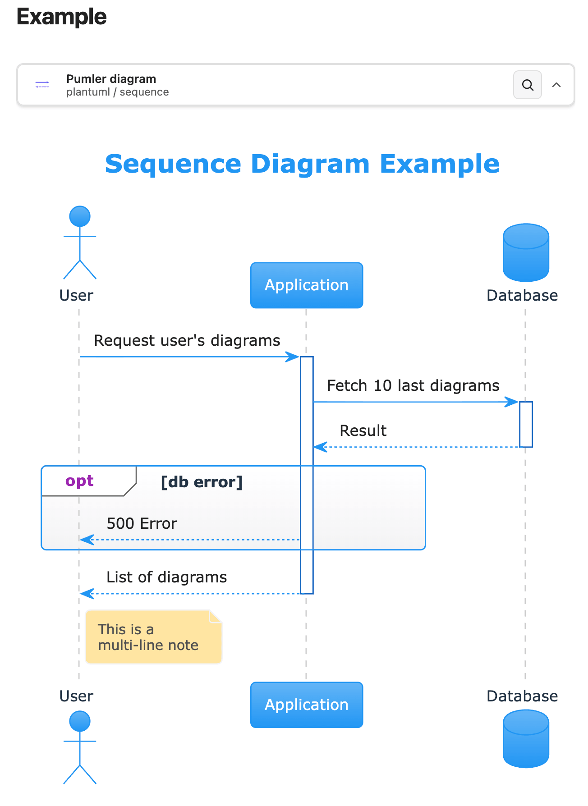
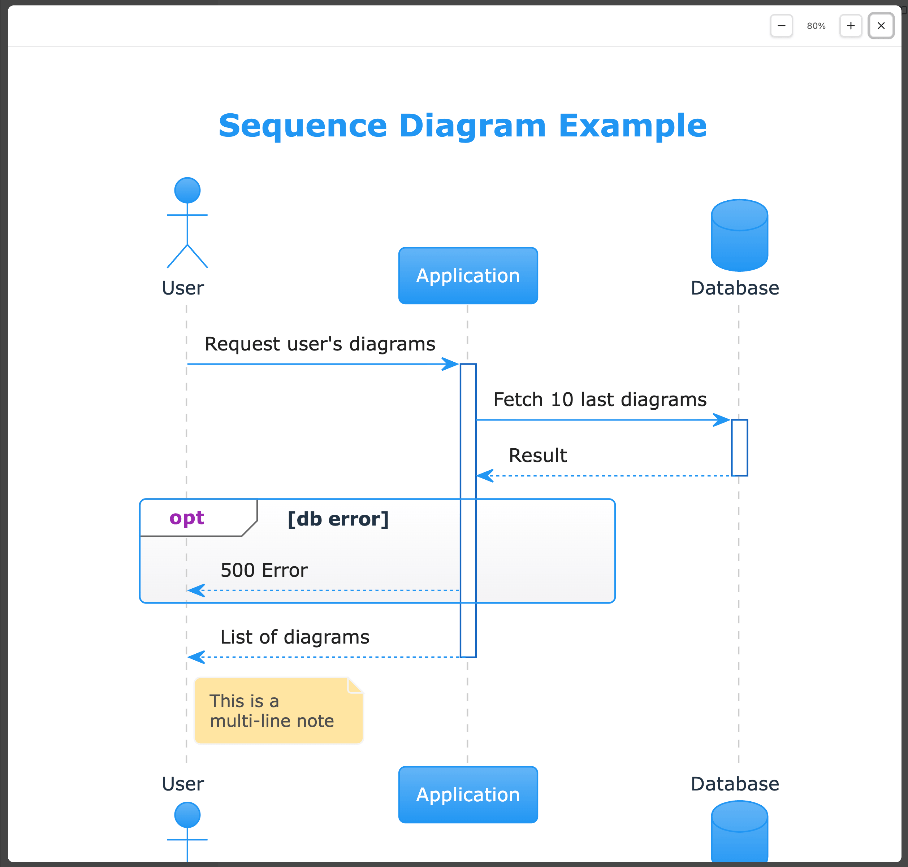

# Pumler for Obsidian

Render PlantUML, Structurizr DSL, and Mermaid diagrams from `pumler` fenced code blocks in Obsidian notes.

Pumler for Obsidian sends diagram source to the public Pumler rendering API and inserts the returned SVG into your note. It is useful when a vault needs one renderer for several diagram languages without local PlantUML, Structurizr, or Mermaid services.

The online editor is available at [pumler.com](https://pumler.com).

## Features

- Renders `plantuml`, `structurizr`, and `mermaid` diagrams from one code block format.
- Supports per-diagram `light`, `dark`, or `auto` themes.
- Debounces diagram edits before calling the rendering API.
- Caches the 30 most recently used rendered SVGs on disk.
- Provides a collapsible summary row and a large zoomable preview modal.

## Quick start

Add a `pumler` fenced code block with a YAML header:

````markdown
```pumler
---
provider: plantuml
type: sequence
theme: auto
title: Login sequence
---
Alice -> Bob: Hello
Bob --> Alice: Hi
```
````

The plugin processes `pumler` fences. It does not replace Obsidian's native `mermaid` renderer and does not process `mermaid`, `plantuml`, or `structurizr` fences directly.

## UI examples

### Diagram source code

```
---
provider: plantuml
type: sequence
---
title Sequence Diagram Example

actor User
participant "Application" as app
database "Database" as db

User -> app: Request user's diagrams
activate app

app -> db ++: Fetch 10 last diagrams
db --> app --: Result
opt db error
	app --> User: 500 Error
end

return List of diagrams

note right of User
	This is a
	multi-line note
end note
```

### Preview



### Zoomed



## Settings

Each diagram is configured in the YAML header at the top of the code block.

| Setting | Required | Values | Default | Description |
| --- | --- | --- | --- | --- |
| `provider` | yes | `plantuml`, `structurizr`, `mermaid` | none | Diagram language rendered by Pumler. |
| `type` | yes | Provider-specific type listed below | none | Diagram type sent to the Pumler API as `diagramType`. |
| `theme` | no | `auto`, `dark`, `light` | `auto` | Per-diagram theme. `auto` follows the current Obsidian theme and sends `dark` or `light` to the API. |
| `title` | no | any string | none | Local Obsidian label shown when the diagram is collapsed. It is not sent to the Pumler API. |

## Examples

### PlantUML sequence

````markdown
```pumler
---
provider: plantuml
type: sequence
theme: auto
title: Login sequence
---
actor User
participant "Obsidian note" as Note
participant "Pumler API" as API

User -> Note: Edit diagram
Note -> API: Render request
API --> Note: SVG
```
````

### Mermaid flowchart

````markdown
```pumler
---
provider: mermaid
type: flowchart
theme: light
title: Rendering flow
---
flowchart LR
  note[Obsidian note] --> api[Pumler API]
  api --> svg[Rendered SVG]
```
````

### Structurizr system context

````markdown
```pumler
---
provider: structurizr
type: systemContext
theme: dark
title: Knowledge base context
---
workspace {
  model {
    user = person "User"
    system = softwareSystem "Knowledge Base"
    user -> system "Reads and writes notes"
  }

  views {
    systemContext system {
      include *
      autoLayout
    }
  }
}
```
````

## Supported diagram types

### PlantUML

`sequence`, `usecase`, `class`, `object`, `activity`, `component`, `deployment`, `state`, `timing`, `archimate`, `mindmap`, `wbs`, `json`, `yaml`, `er`, `nwdiag`

### Structurizr

`systemContext`, `container`, `component`, `deployment`

### Mermaid

`flowchart`, `sequence`, `class`, `er`, `journey`, `gantt`, `pie`, `quadrant`, `requirement`, `gitgraph`, `c4`, `mindmap`, `timeline`, `sankey`, `xychart`, `block`, `packet`, `kanban`, `architecture`, `radar`, `treemap`

## API, privacy, and cache

Diagram source is sent to the public Pumler API at `https://api.pumler.com/api/diagram/render` for rendering. Do not use this plugin for diagram source that must never leave your device.

Rendered SVGs are cached as files in the plugin cache directory. The cache stores up to 30 recently used render results and removes older entries using LRU pruning. Cache keys are derived from the rendering API URL, provider, diagram type, resolved theme, and diagram source, so changing any of those values creates a different cache entry.

Diagram source is not written to cache filenames or the cache index. The cached SVG is the exact rendered response from the Pumler API, so treat it as sensitive as the rendered diagram itself.

## Development

```bash
npm install
npm run test
npm run build
```

For local testing, copy `main.js`, `manifest.json`, and `styles.css` into a vault plugin directory such as `.obsidian/plugins/pumler/`.
